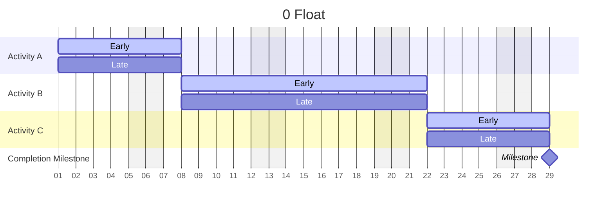
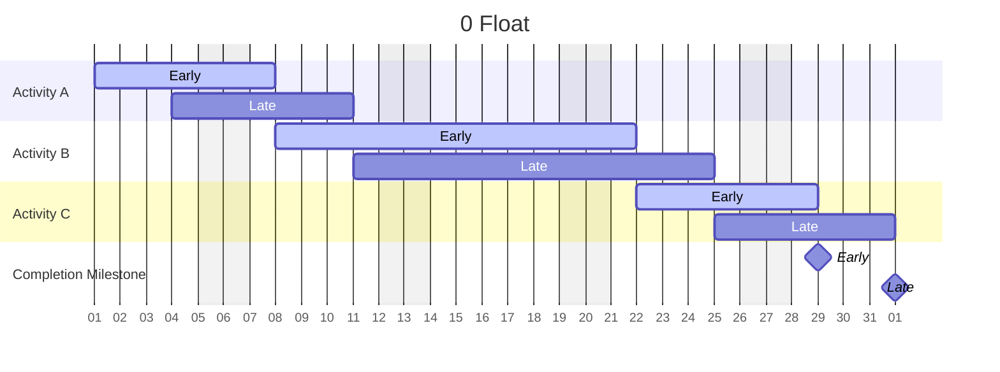
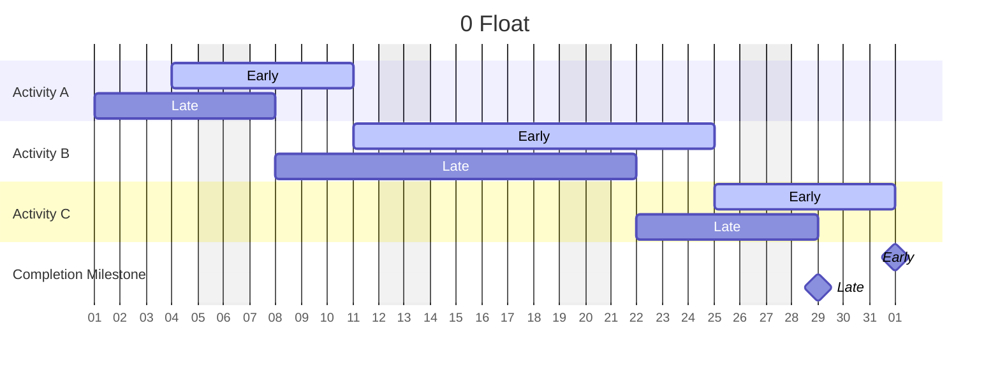

The preferred scheduling technique in the construction industry for the past 40 years has been the **critical path method (CPM)**. Preparing a powerful and effective baseline schedule using CPM may be time-consuming, but it is well worth the effort. In fact, the more you know about the **logic** behind CPM, the more control you will gain over your projects.

Simply put, **CPM** is a scheduling technique that uses **network calculations** to arrange activities based on the “critical path.” More technically, CPM is a scheduling methodology that ties activities to a common network, with the starting **activity** having no **predecessor** and the finish activity having no **successor**. While CPM can theoretically be summarized in one sentence, mastering CPM scheduling is much more of an art. The aim of this section is to help you understand the key components that make up CPM scheduling.

### The Critical Path

The basis of the critical path method is, of course, the **critical path**. In project management, a critical path is the longest sequence of activities in a project that must be completed on time for the project to finish on time. In other words, if any item on a project’s critical path slips, the project can no longer be completed in the allotted timeframe. It is important to identify critical paths on projects, as they must be carefully tracked to keep your project on schedule.

### Float

While CPM scheduling tracks the schedule by determining the longest path (or critical paths), it also addresses the reality that projects do not always progress as scheduled. This is where float comes in. Float is the amount of time an activity can slip before the project end date is affected. The critical path has the lowest relative float value of all activity chains in a CPM schedule. A project schedule can have either positive or negative float. This is described in more detail later in this section.

### Start and Finish Dates

Before calculating the float, you must first determine key dates for each activity. CPM assigns an early start (ES), early finish (EF), late start (LS), and late finish (LF) to each activity on the schedule by using corresponding forward and backward pass calculations (described below).

The early dates are then subtracted from your end dates to determine float. The following simplified case study introduces this concept:

***

### **Simplified One-Activity Case Study**

Let’s say that installing carpet on the third floor of a building will take three days. We know that the earliest date we can start is 02 May 26. This is the early start date, or ES. Because the activity will take three days, the earliest date we can finish is 04 May 26. This is the early finish date, or EF. The act of determining the EF based on the ES and the duration of the work is called the **forward pass**.

Let’s now assume that we also know the carpet must be completed by 07 May 26 before the critical path is affected.

This is the latest date the activity can be completed, or the LF. To determine the corresponding LS, we work backwards three work days, and determine that the LS is 05 May 26. This is the latest date we can begin the work and have it completed on time. The act of determining the LS based on the LF and the duration of the work is called the **backward pass**.

Now that we have determined the ES, EF, LS, and LF, how does this enable us to determine float? Essentially, float is the difference between the latest possible finish date (LF) and the earliest possible finish date (EF), or, conversely, the difference between the LS and the ES. Either way, you will arrive at the same number, a number that reflects how much float, or wiggle room, you have to complete the activity. Using this logic for our carpet installation example, the float for the activity is the difference between the late finish date (LF) of 07May26 and the early finish date (EF) of 04May26. We therefore have three days of (positive) float for this specific activity.

<Tip>
## What is float?

Non-technical definition of float: **Wiggle Room**

CPM representation of total float (TF):

$$LF - EF = TF$$
</Tip>

### CPM Calculations

Our carpet installation example uses common sense to establish the ES, EF, LS, and LF dates. The good news, however, is that CPM translates common sense into a mathematical equation, as follows, for ease of calculation on complex projects:

<Note>
### Forward and backward pass:

$$ES + RD - 1d = EF$$ \
$$LS + RD - 1d = LF$$

$$EF - RD + 1d = ES$$\
$$LF - RD + 1d = LS$$
</Note>

<Note>
### Glossary

ES = Early Start

EF = Early Finish

LS = Late Start

LF = Late Finish

RD = Remaining Duration

TF = Total Float
</Note>

### Establishing the Critical Path

You now have the basic information you need to determine the critical path. Remember, the critical path is “the longest sequence of activities in a project that must be completed on time for the project to finish on time.” This path is also the path with the lowest relative total float (when you consider the float from each activity on the schedule, you arrive at your lowest total float). When a project is on schedule, or ahead of schedule, your critical float value will be zero or some positive number. On the other hand, if you are behind schedule, negative float is generated.

### Float Examples and Summaries

The tables on the next page illustrate three scenarios for a simplified, three-activity schedule: zero float, positive float and negative float. In all cases two bars are shown, the early bar in green and the late bar in blue. Based on the aforementioned float calculations, you can see how the early and late bars differ depending on whether the schedule is on, ahead or behind schedule. (The shaded areas represent weekends.)

#### **0 Day Critical Path (Total Float = 0 days)**

In this case, the critical path is 0 days. This means that the early bar and late bar dates are identical. The float calculation will glean an answer of 0 when you subtract the early dates (green/time now bars) from the late dates (blue/drop dead dates).

| Activity ID | Activity Description | Orig Dur | Early Start | Early Finish |
| ----------- | -------------------- | -------- | ----------- | ------------ |
| 1000        | Activity A           | 10       | 02JUL12     | 13JUL12      |
| 1010        | Activity B           | 20       | 16JUL12     | 10AUG12      |
| 1020        | Activity C           | 10       | 13AUG12     | 24AUG12      |
| 1030        | Completion Milestone | 0        |             | 24AUG12      |

#### **Positive Float (Total Float = 3 Days)**

In this case the critical path is +5 days. This means that the early bars are five days earlier than the late bars. The float calculation will glean an answer of +5 when you subtract the early dates (green/time now bars) from the late dates (blue/drop dead dates).

| Activity ID | Activity Description | Orig Dur | Early Start | Early Finish |
| ----------- | -------------------- | -------- | ----------- | ------------ |
| 1040        | Activity A           | 10       | 25JUN12     | 06JUL12      |
| 1050        | Activity B           | 20       | 09JUL12     | 03AUG12      |
| 1060        | Activity C           | 10       | 06AUG12     | 17AUG12      |
| 1070        | Completion Milestone | 0        |             | 17AUG12      |

#### **Negative Float (Total Float = -5 Days)**

In this case the critical path is -5 days. This means that the early bars are five days later than the late bars. The float calculation will glean an answer of -5 when you subtract the early dates (green/time now bars) from the late dates (blue drop dead dates).

| Activity ID | Activity Description | Orig Dur | Early Start | Early Finish |
| ----------- | -------------------- | -------- | ----------- | ------------ |
| 1080        | Activity A           | 10       | 09JUL12     | 20JUL12      |
| 1090        | Activity B           | 20       | 23JUL12     | 17AUG12      |
| 1100        | Activity C           | 10       | 20AUG12     | 31AUG12      |
| 1110        | Completion Milestone | 0        |             | 31AUG12      |

<Frame>

 </Frame>

<Warning>
**QR**: Quick step-by-step reference to the process presented

1. To determine the amount of float in a project using CPM, the activities’ early and late start and finish dates must be established using your scheduling program’s forward and backward pass algorithms.
2. Once these dates have been established (ES, EF, LS, LF), float can be determined by subtracting your activities’ early dates from the corresponding late dates. This is done for all activities on the schedule.
3. The critical path is then defined by the string of activities with the lowest amount of total float in a project.
</Warning>

**Critical path**: Interrelationship of all activities

**CPM Shows**: Logical sequence of construction, Off/on site activities
