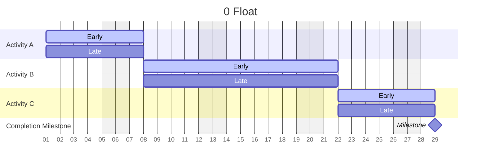
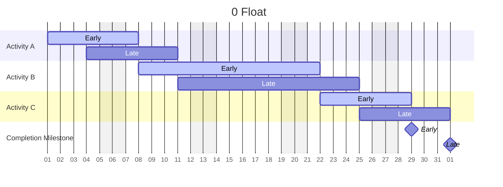
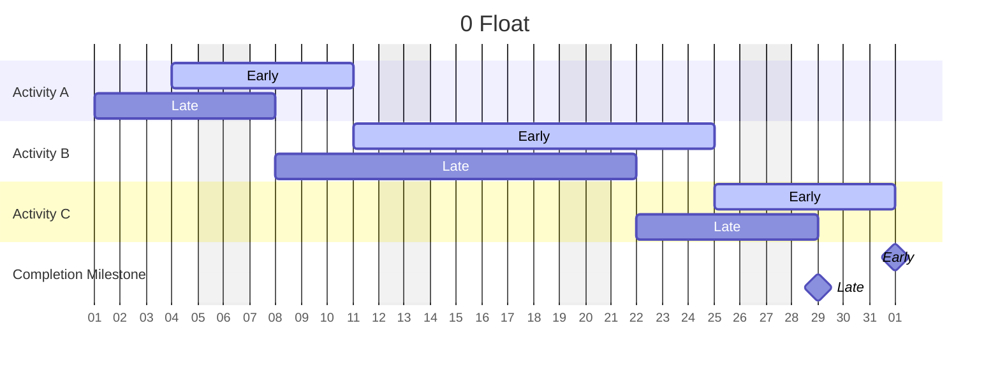

## 2.0 Introduction

The Critical Path Method (CPM) should be used because it is the tried and true method of scheduling, used for decades as a basis of not only project planning but also delay analyses and claims.

The CPM is simply a method of scheduling a project where activities are based on network calculations. This method utilizes activity durations and corresponding relationships between the activities to calculate early and late start and finish dates and float based on the differences between the early and late dates.

A CPM includes more than just the graphical plot of the schedule, but also the mathematical analysis, early and late dates and float. One means little without the other.

Most complex projects require this type of consideration of scheduling activities over time.

#### A CPM can:

## 2.1 The Value of a CPM

A good CPM schedule is the foundation of a successful construction project. Proper CPM scheduling increases the likelihood of success for contractors and owners and decreases the potential for financial losses associated with delays. It is a management tool that evaluates progress and analyzes the impact of day-to-day operations on the overall construction project.

Unfortunately, not all CPM schedules bring such value to the project. You must spend the appropriate amount of time and effort on its development to ensure you have a tool for your project’s success.

Therefore, a CPM schedule is more than just a schedule. A good CPM allows the project manager to build the project on the computer before building it in the field.

#### A good CPM schedule shows the:

* interrelationship of all activities;
* logical sequence of construction;
* emphasis of on-site and off-site activities, and;
* relationship of each activity to the overall project completion.

<Warning>
Anyone in construction project management will be better equipped to take on the challenges and complexities of managing the construction project if they are prepared.

There is no better way of being prepared than to develop a fully detailed CPM.
</Warning>

## **2.2 The CPM Crash Course: Discovering the Critical Path**

The preferred scheduling technique in the construction industry for the past 40 years has been the **critical path method (CPM)**. Preparing a powerful and effective baseline schedule using CPM may be time-consuming, but it is well worth the effort. In fact, the more you know about the **logic** behind CPM, the more control you will gain over your projects.

Simply put, **CPM** is a scheduling technique that uses **network calculations** to arrange activities based on the “critical path.” More technically, CPM is a scheduling methodology that ties activities to a common network, with the starting **activity** having no **predecessor** and the finish activity having no **successor**. While CPM can theoretically be summarized in one sentence, mastering CPM scheduling is much more of an art. The aim of this section is to help you understand the key components that make up CPM scheduling.

### The Critical Path

The basis of the critical path method is, of course, the **critical path**. In project management, a critical path is the longest sequence of activities in a project that must be completed on time for the project to finish on time. In other words, if any item on a project’s critical path slips, the project can no longer be completed in the allotted timeframe. It is important to identify critical paths on projects, as they must be carefully tracked to keep your project on schedule.

### Float

While CPM scheduling tracks the schedule by determining the longest path (or critical paths), it also addresses the reality that projects do not always progress as scheduled. This is where float comes in. Float is the amount of time an activity can slip before the project end date is affected. The critical path has the lowest relative float value of all activity chains in a CPM schedule. A project schedule can have either positive or negative float. This is described in more detail later in this section.

### Start and Finish Dates

Before calculating the float, you must first determine key dates for each activity. CPM assigns an early start (ES), early finish (EF), late start (LS), and late finish (LF) to each activity on the schedule by using corresponding forward and backward pass calculations (described below).

The early dates are then subtracted from your end dates to determine float. The following simplified case study introduces this concept:

***

### **Simplified One-Activity Case Study**

Let’s say that installing carpet on the third floor of a building will take three days. We know that the earliest date we can start is 02 May 26. This is the early start date, or ES. Because the activity will take three days, the earliest date we can finish is 04 May 26. This is the early finish date, or EF. The act of determining the EF based on the ES and the duration of the work is called the **forward pass**.

Let’s now assume that we also know the carpet must be completed by 07 May 26 before the critical path is affected.

This is the latest date the activity can be completed, or the LF. To determine the corresponding LS, we work backwards three work days, and determine that the LS is 05 May 26. This is the latest date we can begin the work and have it completed on time. The act of determining the LS based on the LF and the duration of the work is called the **backward pass**.

Now that we have determined the ES, EF, LS, and LF, how does this enable us to determine float? Essentially, float is the difference between the latest possible finish date (LF) and the earliest possible finish date (EF), or, conversely, the difference between the LS and the ES. Either way, you will arrive at the same number, a number that reflects how much float, or wiggle room, you have to complete the activity. Using this logic for our carpet installation example, the float for the activity is the difference between the late finish date (LF) of 07May26 and the early finish date (EF) of 04May26. We therefore have three days of (positive) float for this specific activity.

<Note>
## What is float?

Non-technical definition of float: **Wiggle Room**

CPM representation of total float (TF):

$$LF - EF = TF$$
</Note>

### CPM Calculations

Our carpet installation example uses common sense to establish the ES, EF, LS, and LF dates. The good news, however, is that CPM translates common sense into a mathematical equation, as follows, for ease of calculation on complex projects:

<Note>
### Forward and backward pass:

$$ES + RD - 1d = EF$$ \
$$LS + RD - 1d = LF$$

$$EF - RD + 1d = ES$$\
$$LF - RD + 1d = LS$$
</Note>

<Note>
### Glossary

ES = Early Start

EF = Early Finish

LS = Late Start

LF = Late Finish

RD = Remaining Duration

TF = Total Float
</Note>

### Establishing the Critical Path

You now have the basic information you need to determine the critical path. Remember, the critical path is “the longest sequence of activities in a project that must be completed on time for the project to finish on time.” This path is also the path with the lowest relative total float (when you consider the float from each activity on the schedule, you arrive at your lowest total float). When a project is on schedule, or ahead of schedule, your critical float value will be zero or some positive number. On the other hand, if you are behind schedule, negative float is generated.

### Float Examples and Summaries

The tables on the next page illustrate three scenarios for a simplified, three-activity schedule: zero float, positive float and negative float. In all cases two bars are shown, the early bar in green and the late bar in blue. Based on the aforementioned float calculations, you can see how the early and late bars differ depending on whether the schedule is on, ahead or behind schedule. (The shaded areas represent weekends.)

#### **0 Day Critical Path (Total Float = 0 days)**

In this case, the critical path is 0 days. This means that the early bar and late bar dates are identical. The float calculation will glean an answer of 0 when you subtract the early dates (green/time now bars) from the late dates (blue/drop dead dates).

| Activity ID | Activity Description | Orig Dur | Early Start | Early Finish |
| ----------- | -------------------- | -------- | ----------- | ------------ |
| 1000        | Activity A           | 10       | 02JUL12     | 13JUL12      |
| 1010        | Activity B           | 20       | 16JUL12     | 10AUG12      |
| 1020        | Activity C           | 10       | 13AUG12     | 24AUG12      |
| 1030        | Completion Milestone | 0        |             | 24AUG12      |

#### **Positive Float (Total Float = 3 Days)**

In this case the critical path is +5 days. This means that the early bars are five days earlier than the late bars. The float calculation will glean an answer of +5 when you subtract the early dates (green/time now bars) from the late dates (blue/drop dead dates).

| Activity ID | Activity Description | Orig Dur | Early Start | Early Finish |
| ----------- | -------------------- | -------- | ----------- | ------------ |
| 1040        | Activity A           | 10       | 25JUN12     | 06JUL12      |
| 1050        | Activity B           | 20       | 09JUL12     | 03AUG12      |
| 1060        | Activity C           | 10       | 06AUG12     | 17AUG12      |
| 1070        | Completion Milestone | 0        |             | 17AUG12      |

#### **Negative Float (Total Float = -5 Days)**

In this case the critical path is -5 days. This means that the early bars are five days later than the late bars. The float calculation will glean an answer of -5 when you subtract the early dates (green/time now bars) from the late dates (blue drop dead dates).

| Activity ID | Activity Description | Orig Dur | Early Start | Early Finish |
| ----------- | -------------------- | -------- | ----------- | ------------ |
| 1080        | Activity A           | 10       | 09JUL12     | 20JUL12      |
| 1090        | Activity B           | 20       | 23JUL12     | 17AUG12      |
| 1100        | Activity C           | 10       | 20AUG12     | 31AUG12      |
| 1110        | Completion Milestone | 0        |             | 31AUG12      |

<Warning>
**QR**: Quick step-by-step reference to the process presented

1. To determine the amount of float in a project using CPM, the activities’ early and late start and finish dates must be established using your scheduling program’s forward and backward pass algorithms.
2. Once these dates have been established (ES, EF, LS, LF), float can be determined by subtracting your activities’ early dates from the corresponding late dates. This is done for all activities on the schedule.
3. The critical path is then defined by the string of activities with the lowest amount of total float in a project.
</Warning>

**Critical path**: Interrelationship of all activities

**CPM Shows**: Logical sequence of construction, Off/on site activities

### **2.3 CPM Step-by-Step**

The graphic below breaks CPM into five “simple” steps. In truth, each step is associated with the definitions and calculations and project-specific twists and turns introduced in section 1.1, but breaking CPM down chronologically is a great way to get a grasp on scheduling your project.

<Steps>
<Step title="Establish Goals">
### **Establish Goals**:

If you want to arrive at your destination on time, you need to know where you are going.

**Process for establishing goals:**

1. Gather all project data needed for schedule development
2. Read the contract
3. Identify project-specific goals
4. Coordinate scheduling goals with management.

**Project goals may include one or all of the following:**

* Keeping the project on track
* Illustrating how and when the owner’s overall goals will be met
* Developing phasing to work on an existing campus or within an owner’s budget constraints
* Communicating project progress with stakeholders
* Coordinating construction sequences
* Identifying early procurement items
* Establishing critical path activities
* Insert _your_ project-specific concern here.
</Step>

<Step title="Identify Activities">
### Identify Activities

Break down the goals you have established into manageable work activities to determine which tasks need to be scheduled.

**Process for developing activity lists:**

1. Study the contract drawings and specifications
2. Categorize activities according to responsibility, phase and location
3. Categorize major work by systems, e.g. drywall partitions, mechanical systems, elevators, etc.
4. Break schedule into major segments including general conditions, material procurement, foundations, structure, exterior, rough-ins, finishes, close-out
5. Break out activities into workable units, e.g. framing, first floor; framing, second floor
6. Identify typical “subsets,” then enter this information into a scheduling program
7. Identify duplicate activities such as typical floors or assemblies
8. Talk to your subcontractors for activity details— they are truly experts in their fields

<Warning>
Concentrate on critical activities and trades at first. You can add more detail as you continue to study the specifications and drawings and talk to subcontractors, consultants and colleagues. It isn’t possible to cover everything the first go-around, so don’t get overwhelmed.
</Warning>

**Ask yourself: What is the appropriate level of detail for activities?**

As you generate activity lists, one challenge is determining the “level of detail.” For starters, activities should be _quantifiable and measurable_. In addition, pay attention to the following guidelines:

* Break down activities by subcontractor—“build toilet rooms,” for example, is too vague and encompasses several trades
* As detail is added, code the activities so you can “roll up” to easier-to-read summary bars or hammocks
* Establish consistent detail throughout—if sprinklers are shown by floor, then ductwork, electrical, etc. should also be shown by floor
* Make sure the level of detail for critical-path activities will allow contract changes to tie into the critical path
* Associate milestones with the start or end of groups of activities.
* Make sure you can identify who (subcontractor), what (quantities) and where (location).
</Step>

<Step title="Estimate Durations">
**Estimate Durations**

Now that you have developed your activity list, it is time to determine how long each activity will take.

**Process for developing activity durations:**

1. Select unit of measure (i.e. days, weeks or months)
2. Consider seasonal conditions
3. Identify work restrictions, including local customs, labor agreements, etc.
4. Perform quantity take-offs as needed
5. Use productivity analysis: units per time period, number of crews, manpower
6. Establish production rates, e.g. LF of drywall/day (see Production Rates, section 1.3)

<Warning>
When assigning durations, stay realistic. Overly ambitious activity durations early in the project can mean you spend the rest of the project playing catch-up. Take site logistics, weather impacts and the labor market into account from the start. &#x20;
</Warning>

#### The Duration Calculation Formula

To calculate durations for each of your activities, use the duration calculation formula, below.

<Check>
$$D = Q/PN$$\
\
Where:

D = Duration&#x20;

Q = Quantity

P = Productivity

N = Number of workers or crew
</Check>

#### Q = Quantity

Perform a take-off or refer to the estimate to determine the quantity of each material associated with the items on your activity list. For instance:

> Carpet tile = 600 square yards

#### P = Productivity

Find the productivity rate associated with each activity, using Means, Walker, historic data or other resources. For instance, per the productivity rates starting on page 44:

> Normal productivity rate for one crew, installing carpet tile = 100 SY/day

#### N = Number of workers or crew

Determine your crew size or the number of crews required for each activity. As part of this step, be sure to consider the logistics and area available to perform the work, and the duration of other activities. Contact subcontractors for input as required. For instance, assume that:

> The subcontractor can provide two crews, which the project site will also accommodate = two (2) crews

Keep in mind that in some cases the production rate reflects production per worker, while in others it reflects production per crew.

#### How it works:

Using the numbers from our example:

> 3 days = 600SY/(100SY/day)(2)

### Additional Considerations

#### **Crew sizes:**

* Convert quantities to man-days, using RS Means, Walker, your historical database, or subcontractor input.
* Once you calculate the man-days, then you can determine the crew size or the number of workers needed.
* Can one crew handle the work? If so, does this align with the other trade crews? If the drywall studs are installed by two crews, for instance, you aren’t ahead of the game if the finish trades can only provide one crew.

#### **Overtime:**

* Studies have shown that productivity dwindles when crews work overtime
* Use additional shifts, crews or workers in lieu of overtime, when possible
* Only use overtime for “short schedule gains.”

***

### Learning Curves

When using typical production rate data, do not expect subcontractors to meet that productivity number on the first day. Learning curves vary from trade to trade, and if the subcontractors are required to stop and start work in the field, you may need to take multiple learning curves into account.

.png>)\

***
</Step>

<Step title="Determine Sequences">
**Determine Sequences**:

With your activities and durations in hand, it is now time to determine the relationships between activities.

### **Process for developing activity logic:**

1. Determine when each activity needs to happen relative to other activities
2. Take primary contract relationships into consideration
3. Determine which work must be completed before other activities can begin
4. Determine what work cannot start until other work is complete
5. Determine relationship types (as defined in this section)
6. Use “finish-to-start” relationships whenever possible

<Warning>
Use lags sparingly (a lag is a specified delay between the start or completion of one activity and the start or completion of another activity).
</Warning>

### What are relationship types?

In CPM scheduling, relationship types are used to establish the proper sequencing of activities. There are three relationship types that dictate how a project can be sequenced. The activity relationship types are:

* **Finish to Start (FS)**
* **Start to Start (SS)**
* **Finish to Finish (FF)**

You should start the process of determining a relationship type by asking if the activities meet the F-S relationship (described on the facing page). If they do not, then either the S-S or the F-F relationship will apply. Using this process is the best way to determine your critical paths.

While it is sometimes necessary to introduce lag, there should be a good reason to do so, as described further on.

#### Finish to Start (F-S) Relationship

The finish-to-start relationship occurs when “activity B cannot begin until activity A has been 100 percent completed.” If this is true, this rule tests “positive” and should be used as the relationship type.

If, on the other hand, this relationship does not test positive, the relationship should not be used.

\
F-S example: Metal studs, level 2, cannot begin until CMU, level 2, is 100 percent completed.

&#x20;

Start to Start (S-S) Relationship

The start-to-start relationship occurs when “activity B cannot begin until activity A has at least started.” If this is true, then the rule tests “positive” and should be used as the relationship.

If this relationship tests “negative,” then the S-S relationship should not be used.

\

\
S-S example: Taping and finishing cannot begin until installing the gypsum board has begun.

&#x20;

Finish to Finish (F-F) Relationship

The finish-to-finish relationship occurs when “activity B cannot be 100 percent completed until activity A is 100 percent completed.” If this is true, then the rule tests “positive” and the relationship should be used.

If this relationship tests negative, it should not be used.

\
F-F example: The ceiling tile cannot be 100 percent completed until the ceiling grid is 100 percent installed.

\

Lag

Each of the three relationship constraints includes a scenario that incorporates lag. While lags are often inevitable, they should not be overused.

Lag is expressed numerically, in either workdays or calendar days. Lag represents the number of days anticipated to pass before the next activity can start or finish. The planner/scheduler must exercise discretion to determine how crew, resource or material restraints may dictate using lag strategically.

&#x20;

The planner/scheduler should use lag only after a detailed analysis by the team has determined that each tie is truly representative of how crew and material resources will affect the workflow. The project superintendent must then take responsibility for running the job according to the schedule. Failure to do so may result in withheld progress payments and, in extreme cases, the termination of the contract for failure to comply with the contract terms.

Therefore, communication during this phase is critical.
</Step>

<Step title="Analyze & Adjust">
**Analyze and Adjust**

Before you finalize and publish the schedule, it is critical that you evaluate the initial schedule and make improvements where possible.

**Process for analyzing and adjusting:**

1. Strategically compress the schedule if necessary
2. Strategically expand the schedule if necessary
3. Confirm the project duration is acceptable
4. Check to make sure the critical path is logical
5. Confirm that all pertinent work activities (and trades) are included
6. Make sure all activities are properly linked
7. Confirm that the contract requirements are met.
</Step>
</Steps>